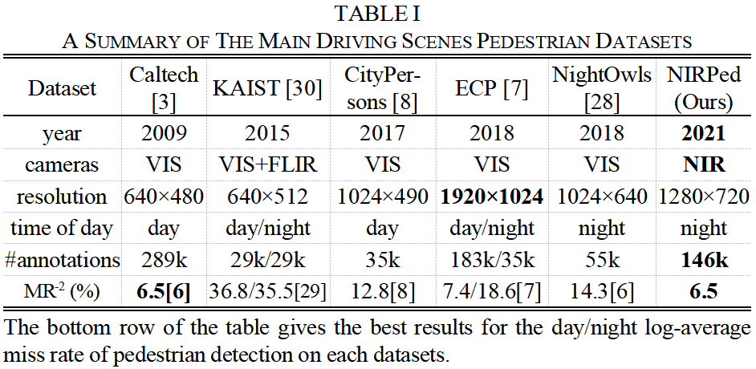
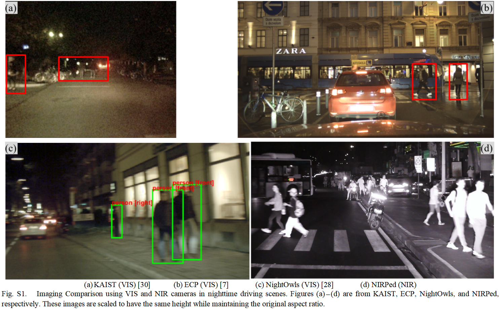
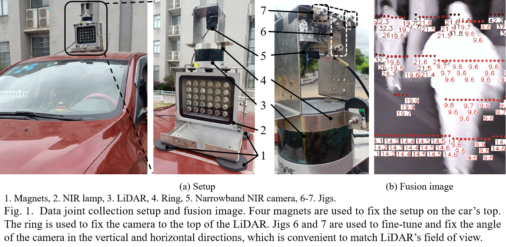
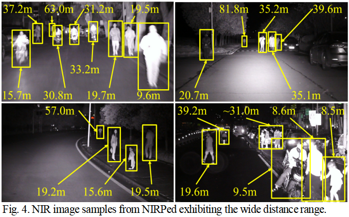
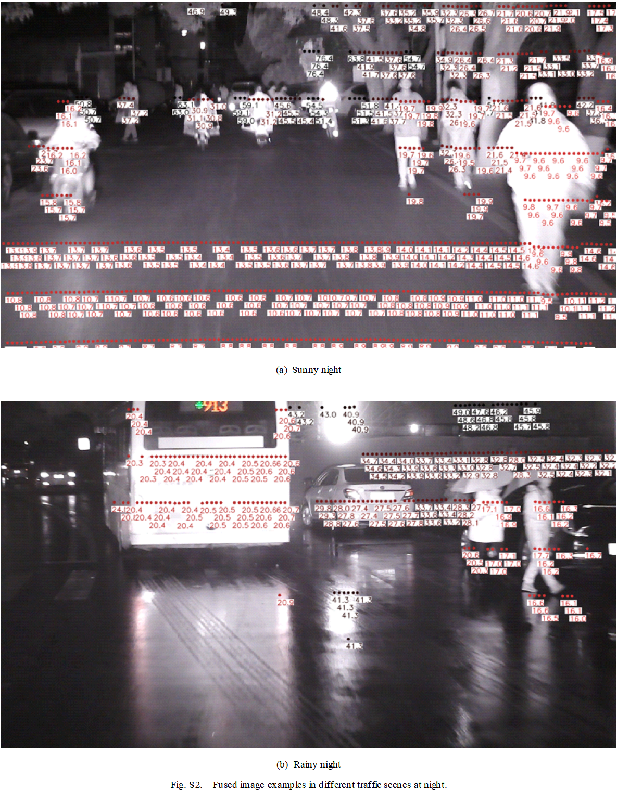
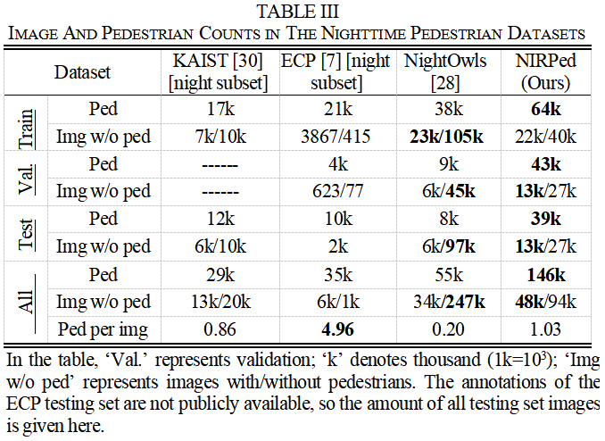
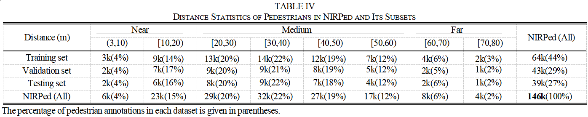
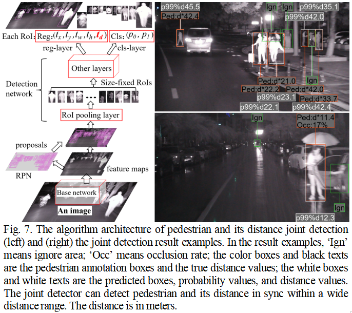
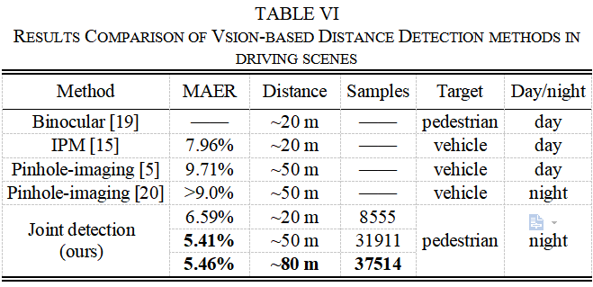

NIRPed: A Novel Benchmark for Nighttime Pedestrian and Its Distance Joint Detection (Implementation based on Tensorflow & Keras)
---
---
# Content
一. [Paper Introduction](#论文介绍)   
I. [Introduction](#简介)  
II. [NIRPed dataset](#数据创新)  
III. [Joint detection](#联合检测方法创新) 
IV. [Performance](#性能表现)  
V. [Conclusion](#结论) 

二. [Implementation based on Tensorflow & Keras](#实施)   
I. [Environment](#所需环境)  
II. [Download](#文件下载)  
III. [How2train](#训练步骤)  
IV. [How2predict](#预测步骤) 
V. [How2eval](#评估步骤)  

三. [References](#参考资料)  
I. [Websites](#参考网址)  
II. [Papers](#参考论文)  

一. Paper Introduction
--- 
I. Introduction  
---
In this study, a narrowband near-infrared (NIR) imaging system is developed, combined with LiDAR to obtain nighttime driving scene images and distance information of pedestrian targets in the images, and constructed a large-scale nighttime pedestrian dataset containing distance attributes. Unlike VIS, NIR is difficult to detect by human eyes, so it does not affect other road users and is not restricted by traffic laws; narrowband NIR is outside the VIS spectral band and its imaging can greatly weaken the interference of uneven VIS in nighttime driving scenes. With the help of supplementary light, narrowband NIR imaging quality will be significantly improved. Based on Faster-RCNN, a method to realize pedestrian and its distance joint detection using monocular images is also proposed herein. Compared with binocular and traditional monocular DD methods, our method eliminates any restrictions of calibration, assumptions and other conditions, and unifies PD and DD into a single deep CNN network driven by big data, thus it is more robust and can be applied in more complex scenes. In the actual application, the system requires only one camera to collect monocular images to realize joint detection, which will greatly reduce the cost of usage and the complexity of data processing.  
**In summary, our contributions are threefold:**  
**(1) A large-scale, competitive and robust narrowband near- infrared nighttime pedestrian dataset containing target distances was constructed as a powerful supplement to NightOwls.**  
**(2) Using LiDAR to obtain the precise distances to support distance detection and fine-grained model optimization.**  
**(3) Extending the Faster-RCNN to achieve joint detection of pedestrian and its distance in one step.** 

   
   

II.  Narrowband NIR Nighttime Pedestrian and Its Distance Joint Detection Dataset
---
A. Data Collection Device  
---
   

B. Data Collection and Target Distance Obtaining  
---
   
   

C. Dataset Construction  
---
  

D. Statistics of Dataset Attributes  
---
 

III.  Faster-RCNN-Based Joint Detection Method for Pedestrian and Its Distance Detection  
---
   

IV. Performance  
---
| train dataset | weight name | test dataset | input image size | MR-2 | AP@0.5 |  MAER |
| :-----: | :-----: | :------: | :------: | :------: | :-----: | :-----: |
| NIRPed | [NIRPed_weights_resnet50.h](https://pan.csu.edu.cn/#/link/3F35F56A95E21A7D2BDE30B3A431936B?path=NIR_PED) | NIRPed-val | 640*256 | **6.5** | **92.4** | **5.46**
| NightOwls | [NightOwls_weights_resnet50.h](https://pan.csu.edu.cn/#/link/3F35F56A95E21A7D2BDE30B3A431936B?path=NIR_PED) | NightOwls-val | 640*256 | 17.2 | 77.7 | -
| ECP | [ECP_weights_resnet50.h](https://pan.csu.edu.cn/#/link/3F35F56A95E21A7D2BDE30B3A431936B?path=NIR_PED) | ECP-val | 640*256 | 21.1 | 81.9 | -
| KAIST | [KAIST_weights_resnet50.h](https://pan.csu.edu.cn/#/link/3F35F56A95E21A7D2BDE30B3A431936B?path=NIR_PED) | KAIST-test | 640*256 | 37.3 | 69.8 | -
  

   

V. Conclusion
---
**In order to cope with the huge challenges of nighttime driving scenes, we selected a narrowband near-infrared imaging system to collect high-quality images and matched LiADR to precisely obtain the distance information in the imaging area. We further constructed a nighttime pedestrian and its distance joint detection dataset NIRPed, which contains 142k narrowband near-infrared images and 236k annotations of pedestrian and other person- related objects. Among them, the pedestrian annotation amounts to 146k, which is 3 times of NightOwls—the largest visible-light nighttime pedestrian dataset at present. For achieving pedestrian detection and distance detection tasks synchronously, we proposed a joint detection method based on Faster-RCNN and monocular images. Our method has been proven to be advantageous in dealing with complex nighttime driving scenes, which will hopefully contribute to the PPS to effectively realize nighttime pedestrian detection and distance detection at low cost.**
  

二. Implementation based on Tensorflow & Keras
---

I. Environment
---
pythonn == 3.9  
tensorflow-gpu == 2.9.0  
keras == 2.9.0  
Please refer to requirements.txt for more configuration.  

II. Download
---
1. Weights  
The required network weights (NIRPed_weights_resnet50.h) can be downloaded from the cloud disk of Central South University (CSU).  
Link: https://pan.csu.edu.cn/#/link/3F35F56A95E21A7D2BDE30B3A431936B?path=NIR_PED  
2. Data  
There are training, validation and testing subset in NIRPed which doesn't need to be divided again.  
Link: https://pan.csu.edu.cn/#/link/3F35F56A95E21A7D2BDE30B3A431936B?path=NIR_PED  

III. How2train
---
A、Training on NIRPed
---
1. Data preparation  
   **Before training, downloaded NIRPed training subset，and unzip images to the folder of "./data/NIRPed/images/train";**   
   **download COCO-format annotation train.json to the folder of "./data/NIRPed/labels".**  
2. Configuration  
   **Open "./keras_frcnn/config.py", modify self.train_img_dir to the training image path (./data/NIRPed/images/train);**  
   **Open "./keras_frcnn/config.py", modify self.train_anno to the training annotation path (./data/NIRPed/labels/train.json).**  
3. Begin training
   Run "train_JointDetector.py" to start training.

B、Training on your own dataset
---
1. Data preparation 
   **Collect the image and target distance information in the image, and make a COCO-format annotation file. **   
   Before training, put the png image files into the folder of "./data/yourDataset/images/train";  
   put the annotation file train.json into the folder of "./data/yourDataset/labels".     
2. Configuration  
   **Open "./keras_frcnn/config.py", modify self.train_img_dir to the training image path (./data/yourDataset/images/train);**  
   **modify self.train_anno to the training annotation path (./data/yourDataset/labels/train.json);**  
   **modify self.class_mapping according to your tasks;**  
   modify other parameters according to your tasks.     
3. Begin training
   Run "train_JointDetector.py" to start training. During the training stage, weights will be saved in the folder of "./model_data".  

IV. How2predict
---
A、Using our weights
---
1. Data preparation  
   **Before prediction, downloaded NIRPed validation or test subset，and unzip images to the folder of "./data/NIRPed/images/val" or "./data/NIRPed/images/test";**   
   **download COCO-format annotation val.json or test.json to the folder of "./data/NIRPed/labels";**  
   **download optimized weight file (NIRPed_weights_resnet50.h) to "./model_data" from CSU cloud disk.**  
2. Configuration  
   **Open "./keras_frcnn/config.py", modify self.val_img_dir or self.test_img_dir to the image path ("./data/NIRPed/images/val" or "./data/NIRPed/images/test");**  
   **modify self.model_path to the model path (./model_data/NIRPed_weights_resnet50.h5).**  
   **Open "Test_JointDetector.py", modify results_dir to the results-saving path ("./results_NIRPed").**  
3. Begin prediction
   Run "Test_JointDetector.py" to start prediction. During the prediction stage, results will be saved in the folder of "./results_NIRPed".  

B、Using your own weights
---
1. Data preparation 
   **After optimizing the weights on your own data, put the weights in the folder of "./model_data".**   
   Before prediction, put the png image files into the folder of "./data/yourDataset/images/val" or "./data/yourDataset/images/test";  
   put the COCO-format annotation file val.json or test.json into the folder of "./data/yourDataset/labels".     
2. Configuration  
   **Open "./keras_frcnn/config.py", modify self.val_img_dir or self.test_img_dir to the image path ("./data/yourDataset/images/val" or "./data/yourDataset/images/test");**  
   **modify self.val_anno or self.test_anno to the annotation paths ("./data/yourDataset/labels/val.json" or "./data/yourDataset/labels/test.json");**  
   **modify self.class_mapping according to your tasks;**  
   modify other parameters according to your tasks.     
   **Open "Test_JointDetector.py", modify results_dir to the results-saving path ("./results_yourDataset").**  
3. Begin prediction
   Run "Test_JointDetector.py" to start prediction. During the prediction stage, results will be saved in the folder of "./results_yourDataset".  

V. How2eval
---
A、Evaluation on NIRPed validation or testing subset
---
1. Data preparation 
   **After prediction, put the results in the folder of "./results_NIRPed";**   
   Before evaluation, put the png image files into the folder of "./data/NIRPed/images/val" or "./data/NIRPed/images/test";  
   put the COCO-format annotation file val.json or test.json into the folder of "./data/NIRPed/labels".    
2. Configuration  
   **Open "./keras_frcnn/config.py", modify self.val_img_dir or self.test_img_dir to the image path ("./data/NIRPed/images/val" or "./data/NIRPed/images/test").**  
   **Open "Evaluate_JointDetector.py", modify Detection_results_dir to the results-saving path ("./results_NIRPed/dt_results_val_B300_001");**  
   modify other parameters in the "Evaluate_JointDetector.py" according to your tasks.     
3. Begin evaluation
   Run Evaluate_JointDetector.py to start evaluation. During the prediction stage, results will be saved in the folder of "./results_NIRPed/dt_results_val_B300_001".    

B、Evaluation on your own dataset (yourDataset)
---
1. Data preparation 
   **After prediction, put the results in the folder of "./results_yourDataset";**   
   Before evaluation, put the png image files into the folder of "./data/yourDataset/images/val" or "./data/yourDataset/images/test";  
   put the COCO-format annotation file val.json or test.json into the folder of "./data/yourDataset/labels".    
2. Configuration  
   **Open "./keras_frcnn/config.py", modify self.val_img_dir or self.test_img_dir to the image path ("./data/yourDataset/images/val" or "./data/yourDataset/images/test").**  
   **Open "Evaluate_JointDetector.py", modify Detection_results_dir to the results-saving path ("./results_yourDataset/dt_results_val_B300_001");**  
   modify other parameters in the "Evaluate_JointDetector.py" according to your tasks.     
3. Begin evaluation
   Run Evaluate_JointDetector.py to start evaluation. During the prediction stage, results will be saved in the folder of "./results_yourDataset/dt_results_val_B300_001".    

三. References
---
I. websites
---
1. https://github.com/jinfagang/keras_frcnn  
2. https://github.com/chenyuntc/simple-faster-rcnn-pytorch  

II. papers
---
[1]	    WHO, “Global Status Report on Road Safety,” World Health Organization, Geneva, Switzerland, Rep. WH018, Jun. 17, 2018.   
[2]	    X. Zhang et al., “Deep Convolutional Neural Networks for All-Day Pedestrian Detection,” in Proc. ICISA, 2017, pp. 171-178.   
[3]	    P. Dollár et al., “Pedestrian detection: an evaluation of the state of the art,” IEEE TPAMI, vol. 34, no.4, pp. 743-761, Apr. 2012.   
[4]	    T. Gandhi et al., “Pedestrian Protection Systems: Issues, Survey, and Challenges," IEEE TITS, vol. 8, no.3, pp. 413-430, Sep. 2007.  
[5]	    A. A. Ali et al., “Distance estimation and vehicle position detection based on monocular camera,” in Proc. AIC-MITCSA, 2016, pp. 1-4.   
[6]	    J. Wu et al., “Temporal-Context Enhanced Detection of Heavily Occluded Pedestrians,” in Proc. CVPR, 2020, pp. 13427-13436.   
[7]	    M. Braun et al., “The EuroCity Persons Dataset: A Novel Benchmark for Person Detection in Traffic Scenes,” IEEE TPAMI, vol. 41, no.8, pp. 1844-1861, 2019.   
[8]	    S. Zhang et al., “CityPersons: A Diverse Dataset for Pedestrian Detection,” in Proc. CVPR, 2017, pp. 4457-4465.   
[9]	    L. Zhang et al., “Is Faster R-CNN Doing Well for Pedestrian Detection?” in Proc. ECCV, 2016, pp. 443-457.   
[10]	D. Matti et al., “Combining lidar space clustering and convolutional neural networks for pedestrian detection,” in Proc. IEEE AVSS, 2017, pp. 1-6.  
[11]	S. Zhang et al., “Occluded Pedestrian Detection Through Guided Attention in CNNs,” in Proc. CVPR, 2018, pp. 6995-7003.   
[12]	M. Kilicarslan and J. Y. Zheng, “DeepStep: Direct Detection of Walking Pedestrian From Motion by a Vehicle Camera,” IEEE Transactions on Intelligent Vehicles, vol. 7, no. 2, pp. 1-11, Jun. 2022.  
[13]	D. Bao et al., “Vehicle distance detection based on monocular vision,” in Proc. PIC, 2016, pp. 187-191.  
[14]	A. Bharade et al., “Statistical approach for distance estimation using Inverse Perspective Mapping on embedded platform,” in Proc. IEEE India Conf., 2014, pp. 1-5.  
[15]	P. Wongsaree et al., “Distance Detection Technique Using Enhancing Inverse Perspective Mapping,” in Proc. Int. Conf. on Comput. And Comm. Syst., 2018, pp. 217-221.  
[16]	R. Adamshuk et al., “On the applicability of inverse perspective mapping for the forward distance estimation based on the HSV colormap,” in Proc. IEEE Int. Conf. on Industr. Technology, 2017, pp. 1036-1041.  
[17]	T. Jia et al., “Depth measurement based on omni-directional camera and pixel offset,” in Proc. WCICI, 2014, pp. 5416-5419.  
[18]	Z. Rumin et al., “A Real-Time Obstacle Detection Algorithm for the Visually Impaired Using Binocular Camera,” in Proc. Int. Conf. in Commun. Signal Process. And Syst., 2017, pp. 1412-1419.   
[19]	S. Nedevschi et al., “Stereo-Based Pedestrian Detection for Collision- Avoidance Applications,” IEEE TITS, vol. 10, no.3, pp. 380-391, Sep. 2009.  
[20]	M. Rezaei et al., "Robust Vehicle Detection and Distance Estimation Under Challenging Lighting Conditions," IEEE TITS, vol. 16, no.5, pp. 2723-2743, Mar. 2015.  
[21]	X. Dai et al., “Multi-task faster R-CNN for nighttime pedestrian detection and distance estimation,” Infrared Physics & Technology, vol. 115, p. 103694, Jun. 2021.   
[22]	X. Dai et al., “Near infrared nighttime road pedestrian recognition based on convolutional neural network,” Infrared Physics & Technology, vol. 97, pp. 25-32, Mar. 2019.   
[23]	L. Zhang et al. (2019). “The Cross-Modality Disparity Problem in Multispectral Pedestrian Detection.” [Online]. Available: https://arXiv.org/abs/1901.02645   
[24]	C. Li et al., “Illumination-aware faster R-CNN for robust multispectral pedestrian detection,” Pattern Recognit., vol. 85, pp. 161-171, Jan. 2019.   
[25]	S. K. Biswas et al., “Linear support tensor machine with LSK channels: pedestrian detection in thermal infrared images,” IEEE TIP, vol. 26, no.9, pp. 4229-4242, May 2017.   
[26]	L. Lu et al., “Infrared Pedestrian Segmentation Through Background Likelihood and Object-Biased Saliency,” IEEE TITS, vol. 19, no.9, pp. 2826-2844, Nov. 2017.   
[27]	M. A. Galarza-Bravo et al., “Pedestrian Detection at Night Based on Faster R-CNN and Far Infrared Images,” in Proc. Int. Conf. on Intell. Robotics and Appl., 2018, pp. 335-345.   
[28]	L. Neumann et al., “NightOwls: A Pedestrians at Night Dataset,” in Proc. ACCV, 2018, pp. 691-705.   
[29]	J. Liu et al. (2016). “Multispectral Deep Neural Networks for Pedestrian Detection,” [Online]. Available: http://arxiv.org/abs/1611.02644   
[30]	S. Hwang et al., “Multispectral pedestrian detection: Benchmark dataset and baseline,” in Proc. CVPR, 2015, pp. 1037-1045.   
[31]	Z. Zhao et al., “Object Detection with Deep Learning: A Review,” IEEE TNNLS., vol. 30, no.11, pp. 3212-3232, Jan. 2019.  
[32]	R. Girshick et al., “Rich Feature Hierarchies for Accurate Object Detection and Semantic Segmentation,” in Proc. CVPR, 2014, pp. 580-587.  
[33]	R. Girshick, “Fast R-CNN,” in Proc. ICCV, 2015, pp. 1440-1448.   
[34]	S. Ren et al., “Faster R-CNN: Towards Real-Time Object Detection with Region Proposal Networks,” IEEE TPAMI, vol. 39, no.6, pp. 1137-1149, Jun. 2016.  
[35]	J. Redmon et al., “You Only Look Once: Unified, Real-Time Object Detection,” in Proc. CVPR, 2015, pp. 779-788.  
[36]	J. Leng et al., "Robust Obstacle Detection and Recognition for Driver Assistance Systems," IEEE TITS, vol. 21, no.4, pp. 1560-1571, Apr. 2020.  
[37]	T. Lin et al., “Microsoft COCO: Common Objects in Context,” in Proc. ECCV, 2014, pp. 740-755.  
[38]	K. He et al., “Deep Residual Learning for Image Recognition,” in Proc. CVPR, 2016, pp. 770-778.  
[39]	Y. Tian et al., "Depth estimation for advancing intelligent transport systems based on self-improving pyramid stereo network," IET Intell. Transp. Syst., vol. 14, no.5, pp. 338-345, Jul. 2020.  
[40]	S. Liang et al., “A Novel Sparse Geometric 3-D LiDAR Odometry Approach,” IEEE Syst. J., vol. 15, no.1, pp. 1390-1400, Mar. 2020.  
[41]	H. Gao et al., “Object classification using CNN-based fusion of vision and LIDAR in autonomous vehicle environment,” IEEE TII, vol. 14, no. 9, pp. 4224-4231, Apr. 2018.  
[42]	Z. Rumin et al., "A Real-Time Obstacle Detection Algorithm for the Visually Impaired Using Binocular Camera," in Proc. Int. Conf. in Comm., Signal Process., and Syst., 2017, pp. 1412-1419.  
[43]	S. Joung et al., "Unsupervised Stereo Matching Using Confidential Corresp- ondence Consistency," IEEE TITS, vol. 21, no.5, pp. 2190-2203, May 2020.  
[44]	A. Geiger et al., “Automatic camera and range sensor calibration using a single shot,” in Proc. ICRA, 2012, pp. 3936-3943.   
[45]	Intelligent transport systems-Forward vehicle collision warning systems- Performance requirements and test procedures, ISO15623, I. T. Systems, Switzerland, 2013.  
